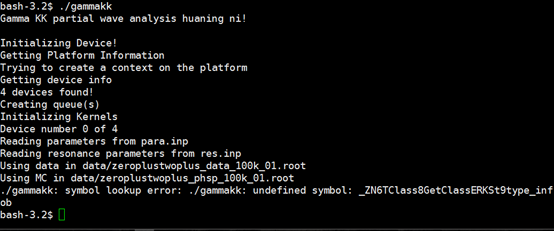
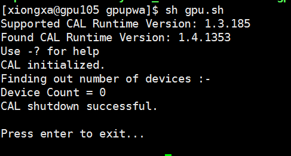
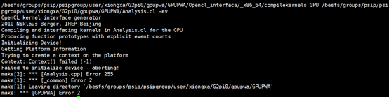
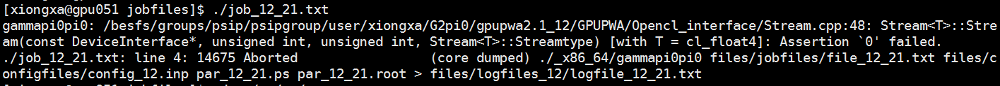
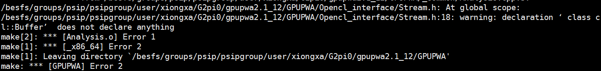
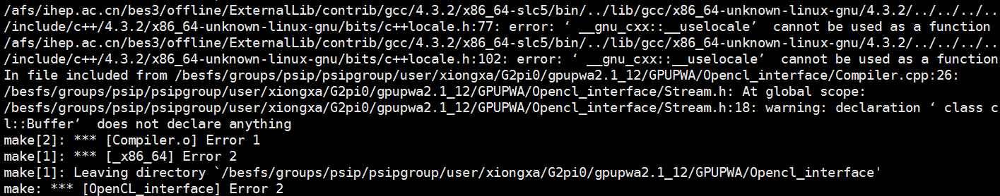
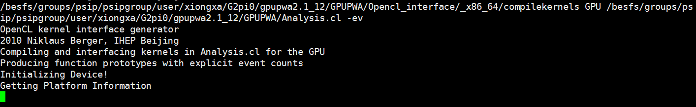
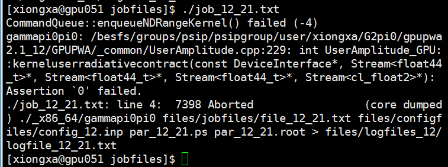
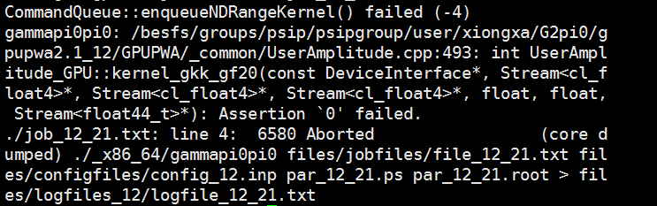
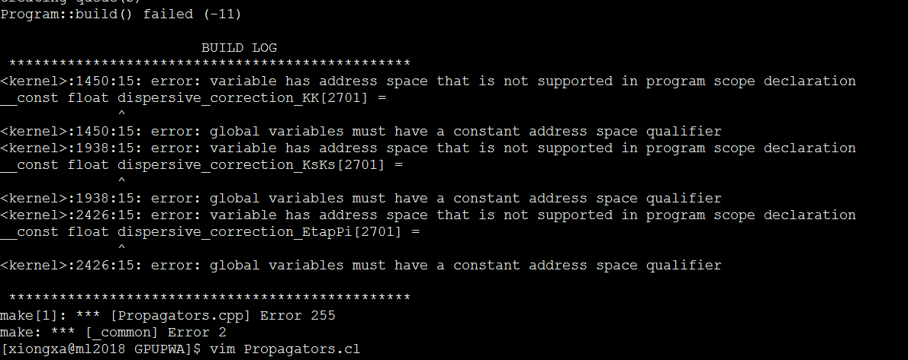

Issue track 
## 1.使用gpu105登陆，GPUPWA 2.1，使用GammKK测试时，编译通过了，运行时报错。

### 解决办法
gpu105只能运行1.9的程序；注释掉BOSS的环境

## 2.硬件问题，需要机器重启

### 编译时报错：

### 解决办法
在终端输入以下命令看看输出
fglrxinfo

aticonfig --adapter=all --odgt

aticonfig --adapter=all --odgc

重启机器。

##  3.内存分配1024*1024 程序报错

## 4.程序运行时中断ctrl + c 报错

### 解决办法
重启机器。

## 5.分波数目过多

### 解决办法
与GPU显存和数据MC事例数有关。
应该考虑把MC积分划分成几批来做，然后再求和。每一批的事例数不太大就可以了。
MC需要多少并不是要依据数据的多少倍，而是要看MC积分的精度是否达到要求。
事例数少的时候大概取个10倍就可以了。
MC积分的精度你可以通过逐渐增加事例数，观察积分的到的矩阵元FUN值的变化，当事例数增加FUN没有显著变化的时候，说明统计量已经足够了，再多的统计量也没有意义。

## 6.编译时propagator.cl报错

### 解决办法
原因是在NVIDIA的卡中（OpenCL），__cont需要改成 __constant
